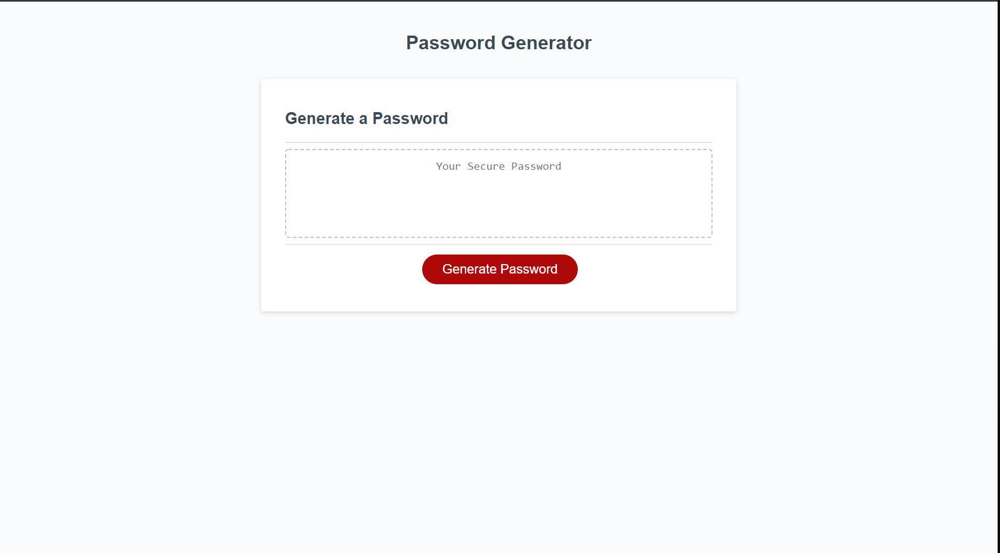

# Week 3 Challenge - Password Generator

## Description

This week's Challenge requires you to create an application that an employee can use to generate a random password based on criteria they've selected. This app will run in the browser, and will feature dynamically updated HTML and CSS powered by JavaScript.

## Installation

Website Url: https://a-speece.github.io/Week_3_Challenge_Password_Generator/ Git Hub link: https://github.com/A-Speece/Week_3_Challenge_Password_Generator.git

## Usage

The user will be asked to select a series of questions to generate a random password that can be used.

## Screenshot

